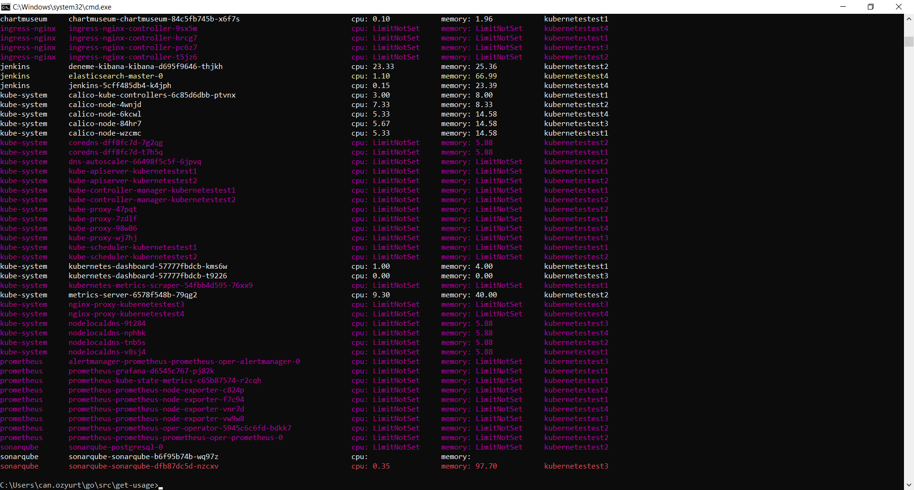

### get-usage

This is a kubectl plugin I made to learn golang over a weekend. It fetches both pod list and top list to make a colored table based on resource consumption. Only tested on on-prem.

Red     One resource is above %80

Yellow  One resource is above %50

Magenta Limit is missing on one resource

Example output:

