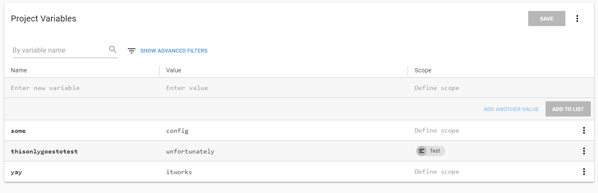
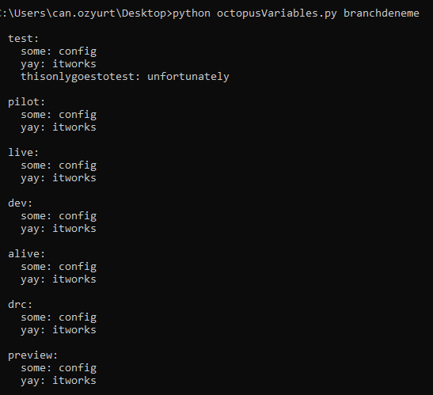
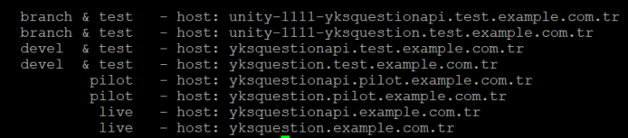

### getOctopusVariables.py

Since we are switching over from Octopus Deploy, all the configuration is stored in Octopus. This script extracts the conf of the desired project and outputs in ready-to-cp format into values.yaml with the right indentation.

Example output:

### ingress-test.py

This python script was written prior to ingress template to test out all the possible domains.

Example output:

